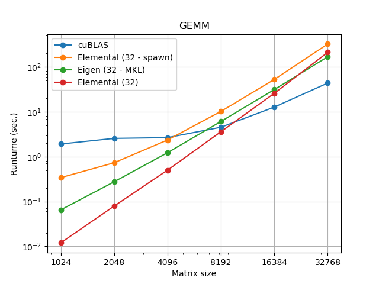

# EigenCuda

Offload the [Eigen3](http://eigen.tuxfamily.org/index.php?title=Main_Page) matrix matrix multiplacation to GPU
using [cublas](https://docs.nvidia.com/cuda/cublas/index.html).

## CMake Installation

To compile execute:
```
cmake -H. -Bbuild && cmake --build build
```

To Debug compile as:
```
cmake -H. -Bbuild  -DCMAKE_BUILD_TYPE=Debug && cmake --build build
```

## Dependencies

This packages assumes that you have installed the following packages:

  
  * [Cxxopts](https://github.com/jarro2783/cxxopts)
  * [Cudatoolkit](https://anaconda.org/anaconda/cudatoolkit)
  * [Eigen3](http://eigen.tuxfamily.org/index.php?title=Main_Page)

## Usage
```cpp
#include "eigencuda.hpp"

auto size = 100;
Mat<float> A = Mat<float>::Random(size + 10, size);
Mat<float> B = Mat<float>::Random(size, size + 20);

Mat<float> C = eigencuda::cublas_gemm(A, B);
```
where `Mat` is defined as :
```cpp
template <typename T>
using Mat = Eigen::Matrix<T, Eigen::Dynamic, Eigen::Dynamic, Eigen::ColMajor>;
```

## Running the example
```
./cublas --size 100
```

where `size` is the size of the matrix 

## Example of performance


